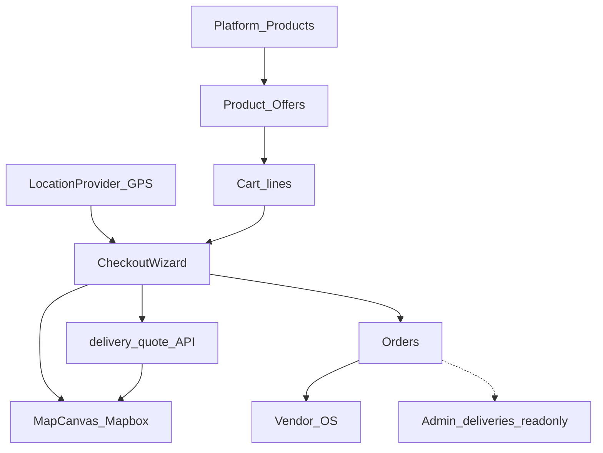

# Location, maps, delivery & vendor ecosystem

Canonical reference for KlikCollect’s geo stack, checkout fulfilment, multi-vendor marketplace, and Vendor OS. For Mapbox UI chrome and style presets only, see also [`docs/maps.md`](maps.md).

**Last reviewed against codebase:** 2026-08-12.

---

## 1. Executive summary

KlikCollect is a **multi-vendor marketplace** centred on Nairobi:

| Layer | Ownership |
|-------|-----------|
| **Catalogue products** | Platform (canonical identity, barcodes, media) |
| **Offers** | Vendors (price, stock, optional store location) |
| **Cart / checkout** | Buyer chooses an *offer*, not just a product |
| **Maps** | Mapbox GL JS only (no Google Maps JS SDK) |
| **Fulfilment** | Pickup is primary; home delivery is quoted and mapped at checkout |
| **Courier dispatch** | **Retired** as a product plane (`couriers` feature flag defaults `false`) |

**Live today**

- Buyer GPS + delivery pin, Mapbox search/directions/isochrone on checkout
- Road-km delivery fees (KES) with zone flat-fee fallback
- Multi-shop route preview and delivery-optimize hints
- Vendor branches with lat/lng, store hours, public storefront maps
- Admin read-only deliveries list

**Schema / RBAC only (not a live courier product)**

- `deliveries`, `driver_locations`, driver profiles/ratings
- Delivery roles (`vendor_driver`, `dispatch_manager`, …) gated behind `couriers`
- Routes `/eats`, `/delivery`, `/app/couriers` redirect home

---

## 2. Architecture



**Authority split**

1. Platform curates **products**.
2. Vendors publish **offers** (`product_offers`) against those products.
3. Cart lines key on **`offerId`** (vendor-specific price/stock).
4. Checkout may span multiple vendors (multiple stops).
5. Each vendor fulfils packing in Vendor OS; order status ends at **collected** (pickup-centric lifecycle).

---

## 3. Maps & location stack

### 3.1 Stack choice

- **Runtime:** `mapbox-gl` + `@mapbox/search-js-react`
- **Token:** public `pk.*` only via `NEXT_PUBLIC_MAPBOX_ACCESS_TOKEN` ([`lib/mapbox.ts`](../lib/mapbox.ts) → `getMapboxToken()`)
- **Default centre:** Nairobi `[36.8219, -1.2921]` (`NAIROBI_CENTER`)
- **Google:** outbound deep links / Street View embeds only ([`lib/external-maps.ts`](../lib/external-maps.ts)) — no Google Maps JS SDK

### 3.2 Environment

| Variable | Purpose |
|----------|---------|
| `NEXT_PUBLIC_MAPBOX_ACCESS_TOKEN` | Required public token |
| `NEXT_PUBLIC_MAPBOX_STYLE` | Primary basemap (default Mapbox Standard) |
| `NEXT_PUBLIC_MAPBOX_SATELLITE_STYLE` | Satellite preset |
| `NEXT_PUBLIC_MAPBOX_3D_STYLE` | 3D / terrain preset |

### 3.3 Shared map UI

| Path | Role |
|------|------|
| [`components/map/MapCanvas.tsx`](../components/map/MapCanvas.tsx) | Core Mapbox engine: markers, clustering, routes, isochrone layers, style fallback |
| [`components/map/MapChrome.tsx`](../components/map/MapChrome.tsx) | Style / POV toggles, zoom, recenter, glass chrome |
| [`components/map/AdvancedNavMap.tsx`](../components/map/AdvancedNavMap.tsx) | Origin/destination, directions, GPS follow |
| [`components/map/MapSearchBox.tsx`](../components/map/MapSearchBox.tsx) | Address Search Box → pin |
| [`components/map/AdvancedMapSearch.tsx`](../components/map/AdvancedMapSearch.tsx) | Search + commerce GeoJSON |
| [`components/map/MapPreview.tsx`](../components/map/MapPreview.tsx) | Compact offer pins (PDP) |
| [`components/map/MapEtaHud.tsx`](../components/map/MapEtaHud.tsx) | ETA / distance overlay |
| [`components/map/PlaceSheet.tsx`](../components/map/PlaceSheet.tsx) | Place / vendor bottom sheet |
| [`components/map/MapListPanel.tsx`](../components/map/MapListPanel.tsx) | Side list of places |
| [`components/map/MapPopupCard.tsx`](../components/map/MapPopupCard.tsx) | Popup card |

**Basemap presets (via MapChrome):** Street (Standard), Perfect (classic Streets), Satellite, 3D.

**Camera POV presets:** Top, Street, Bird, Cinema, Heading, Free.

### 3.4 Checkout & storefront maps

| Path | Audience | Behaviour |
|------|----------|-----------|
| [`components/checkout/CheckoutDeliveryMap.tsx`](../components/checkout/CheckoutDeliveryMap.tsx) | Buyer | Pin drop, reverse geocode, isochrone, multi-shop routes |
| [`components/checkout/DeliveryLocationStep.tsx`](../components/checkout/DeliveryLocationStep.tsx) | Buyer | Address fields + map + quote + saved pins |
| [`components/checkout/PickupCollectStep.tsx`](../components/checkout/PickupCollectStep.tsx) | Buyer | Shop markers, flyTo selected branch |
| Cart page (`app/(storefront)/cart`) | Buyer | Compact route preview via AdvancedNavMap |
| [`components/storefront/VendorLocationMap.tsx`](../components/storefront/VendorLocationMap.tsx) | Buyer | Vendor branch pins |
| Product PDP MapPreview | Buyer | Offer locations + distance-aware estimates |

### 3.5 Mapbox APIs (server/client helpers)

[`lib/mapbox-api.ts`](../lib/mapbox-api.ts) (re-exported via [`lib/mapbox-search.ts`](../lib/mapbox-search.ts)):

- Search Box suggest / retrieve
- Forward & reverse geocoding
- Directions, Matrix, Map Matching
- Isochrone (default contours used in checkout UX, e.g. 15/30 min)
- Static map URL helper via [`lib/mapbox.ts`](../lib/mapbox.ts) `buildStaticMapUrl()`
- Haversine `distanceKm()` for ranking / fallbacks

Commerce map payload: [`lib/map-commerce.ts`](../lib/map-commerce.ts) + `GET /api/map/commerce`.

### 3.6 GPS & saved pins

| Piece | Path | Notes |
|-------|------|-------|
| App-wide GPS | [`components/providers/LocationProvider.tsx`](../components/providers/LocationProvider.tsx) | Watches position; caches `klikcollect:user-location` |
| Nav GPS | [`hooks/useNavGps.ts`](../hooks/useNavGps.ts) | High-accuracy follow (speed/heading) |
| Delivery pin | [`lib/checkout/saved-delivery-pin.ts`](../lib/checkout/saved-delivery-pin.ts) | localStorage pin + activity |
| Saved addresses | [`lib/account-storage.ts`](../lib/account-storage.ts) | Optional lat/lng on `SavedAddress` |
| Recent nav | [`lib/nav/recent-destinations.ts`](../lib/nav/recent-destinations.ts) | `klikcollect:nav-recent` |

### 3.7 What maps are *not*

- **No per-vendor polygon service areas** in the database.
- Isochrone around the **customer pin** is a reachability visualisation, not a hard geofence gate.
- Vendor OS edits branch **lat/lng as text fields** — no Mapbox branch editor in `/app`.

---

## 4. Delivery pricing & zones

### 4.1 Primary engine — road distance

[`lib/checkout/delivery-pricing.ts`](../lib/checkout/delivery-pricing.ts)

```text
fee = max(
  MIN,
  BASE + max(0, roadKm − FREE_KM) × PER_KM + (shops − 1) × STOP_FEE
    + operational adjustments
)
```

| Knob | Value (KES major) |
|------|-------------------|
| Base | 150 |
| Free km | 1 |
| Per km | 40 |
| Minimum fee | 200 |
| Extra shop stop | 80 |
| Peak lunch | +20 |
| Late night | +30 |
| Heavy rain | +40 (Open-Meteo) |
| High-demand area | +25 |

- **Live route:** Mapbox Directions (`quoteHomeDeliveryLive`)
- **Fallback distance:** haversine × 1.35 (`HAVERSINE_ROAD_FACTOR`)
- **ETA:** ~22 km/h + base/stop minutes
- Home delivery is **never free**; hybrid consolidate always has a fee

### 4.2 Zone flat fees (fallback)

[`lib/checkout/delivery-zones.ts`](../lib/checkout/delivery-zones.ts)

- Named Nairobi neighbourhood list with flat fees
- Matched from reverse-geocode / area text (`matchDeliveryZone`)
- Used when routing fails (`source: "zone_fallback"`)

### 4.3 Parallel settlement fee rules

| Piece | Role |
|-------|------|
| Migrations `024` / `025` | `fee_rules` (commission \| delivery), Nairobi `area_key` / `collect_hub` flats |
| [`lib/fees/engine.ts`](../lib/fees/engine.ts) | `quoteFees` for payment/settlement quotes |
| `POST /api/payments/quote` | Uses fee engine (pickup → delivery fee 0 by default) |

Checkout **buyer-facing** quotes use the road-km engine; `fee_rules` is a parallel store for settlement / Stripe-era quoting.

### 4.4 Optimize & routes

| Path | Role |
|------|------|
| [`lib/checkout/delivery-optimize.ts`](../lib/checkout/delivery-optimize.ts) | Suggest switch vendor / drop a stop |
| [`lib/checkout/delivery-routes.ts`](../lib/checkout/delivery-routes.ts) | Shop→home / multi-shop trip geometry + ETA |
| `POST /api/checkout/delivery-quote` | Fee + ETA for bag |
| `POST /api/checkout/delivery-optimize` | Optimization hints |
| `POST /api/checkout/vendors` | Batch vendor coords + hours for checkout |
| [`lib/hooks/useCartDeliveryQuote.ts`](../lib/hooks/useCartDeliveryQuote.ts) | Live cart quote from GPS/pin |

---

## 5. Checkout & fulfilment flows

### 5.1 Modes

| Concept | Values | Where |
|---------|--------|-------|
| Fulfilment | `pickup` \| `delivery` | `types` `FulfilmentMethod`; cart line meta |
| Collect mode | `classic` \| `hybrid` | [`lib/checkout/types.ts`](../lib/checkout/types.ts) |
| Flows | `PICKUP_FLOW`, `DELIVERY_FLOW` | [`components/checkout/fulfilment.ts`](../components/checkout/fulfilment.ts) |

**Classic pickup:** buyer collects from each shop (or selected hubs).  
**Hybrid:** multi-shop bag can consolidate toward one collect hub (quoted separately).

### 5.2 Buyer journey

```text
LocationProvider (GPS)
  → Cart (map preview + useCartDeliveryQuote)
  → CheckoutWizard
      → DeliveryLocationStep (search / pin / address / quote)
      → PickupCollectStep (when pickup)
      → Same-day timing / slots
  → Payments initialize
  → Order created (vendor_ids[], collect_hub, fulfilment meta)
```

Key UI: [`CheckoutWizard.tsx`](../components/checkout/CheckoutWizard.tsx), [`DeliveryOptimizeHints.tsx`](../components/checkout/DeliveryOptimizeHints.tsx), [`SameDayTiming.tsx`](../components/checkout/SameDayTiming.tsx), [`PickupSlotPicker.tsx`](../components/checkout/PickupSlotPicker.tsx), [`lib/checkout/same-day-slots.ts`](../lib/checkout/same-day-slots.ts).

### 5.3 Order lifecycle (live product)

Order statuses in app types:

`pending → confirmed → ready → collected` (+ `cancelled`)

There is **no** in-transit / delivered status on the marketplace order model. Fulfilment is pickup-centric; vendors pack in OS.

### 5.4 Delivery job lifecycle (schema only)

`deliveries` table (migration `015`) statuses:

`pending`, `assigned`, `picked_up`, `in_transit`, `delivered`, `failed`, `cancelled`

Plus polish in `028` (offer-to-driver, ratings). **No app write/assign/track/POD APIs** are live; admin can **list** jobs only.

---

## 6. Vendor marketplace ecosystem

### 6.1 Data model

```text
products (platform)
    ↓ 1:N
product_offers (vendor_id, price_minor, on_hand, reserved, optional store_id)
    ↓ offer_public_id on cart line
carts / cart_items (fulfilment pickup|delivery)
    ↓
orders / order_items (vendor_ids jsonb, per-line vendor + offer)
```

Core cutover: migration **`011_storefront_commerce_cutover.sql`**.

### 6.2 Offer ranking & location

[`lib/offers/rank-offers.ts`](../lib/offers/rank-offers.ts)

- Modes: `best` \| `nearest` \| `cheapest` \| `area`
- Distance via haversine (`distanceKm` from mapbox helpers)
- Filters unavailable / unpublished offers

PDP and cart use ranked offers so “nearest shop” reflects buyer GPS when available.

### 6.3 Public vendor storefront

| Piece | Path |
|-------|------|
| Loader | [`lib/vendor-storefront.ts`](../lib/vendor-storefront.ts) |
| Hours live | [`lib/store-hours-live.ts`](../lib/store-hours-live.ts) (Africa/Nairobi) |
| Shell / status | `VendorStoreShell`, `VendorLiveStatus` |
| Routes | `app/(storefront)/vendors/[slug]/…` |
| APIs | `app/api/vendors/[slug]/` (profile, hours, locations, reviews) |

Branch coords come from `stores.lat` / `stores.lng` (+ seeded founding vendors in [`lib/founding-vendors.ts`](../lib/founding-vendors.ts)).

### 6.4 Cart identity

- Line key = **offer id** ([`lib/cart/lines.ts`](../lib/cart/lines.ts))
- Vendor helpers: [`lib/checkout/cart-vendors.ts`](../lib/checkout/cart-vendors.ts)
- Client cart: [`lib/hooks/useCart.tsx`](../lib/hooks/useCart.tsx), `CartProvider`
- Isolation checks: `scripts/verify-marketplace-isolation.ts`

---

## 7. Vendor OS (operations)

**Root:** `app/(os)/app/` · nav groups in [`components/os/nav.ts`](../components/os/nav.ts) (selling, fulfilment, store, team, money).

| Area | Page | API (typical) |
|------|------|----------------|
| Dashboard | `/app` | `app/api/os/dashboard` |
| Storefront profile | `/app/store` | `app/api/os/store` |
| Hours | `/app/store/hours` | `app/api/os/store/hours` |
| Branches (lat/lng text) | `/app/branches` | `app/api/os/branches` |
| Offers / products | `/app/products` | `app/api/os/offers` |
| Price / stock / availability | — | `offers/[id]/price\|stock\|availability` |
| Inventory | `/app/inventory` | `app/api/os/inventory` |
| Orders / packing | `/app/orders`, `/app/orders/packing` | `app/api/os/orders` |
| POS | `/app/pos` | `app/api/os/pos/sale` (flag-gated) |
| Staff | `/app/staff` | `app/api/os/staff`, invite |
| Control panel | OS chrome | `couriers` retired |

Gate: [`components/os/VendorAccessGate.tsx`](../components/os/VendorAccessGate.tsx).  
Offer mutations: [`lib/offers-mutations.ts`](../lib/offers-mutations.ts), inventory: [`lib/inventory.ts`](../lib/inventory.ts).

**Location note:** OS does not host a Mapbox map for placing branches — operators type coordinates / address text.

---

## 8. Admin & RBAC

### 8.1 Admin surfaces

| Path | Capability |
|------|------------|
| [`app/admin/(protected)/deliveries/page.tsx`](../app/admin/(protected)/deliveries/page.tsx) | Read-only table (status, order, driver, customer, vendor) |
| `/admin/offers`, `/admin/vendors`, `/admin/orders` | Marketplace ops adjacent to delivery |
| Admin nav | Link to deliveries under Marketplace |

Permission: `delivery:view` via `requireAdminPermission`.

### 8.2 Delivery-related roles

Defined in [`lib/authz/roles.ts`](../lib/authz/roles.ts) / [`docs/rbac.md`](rbac.md):

| Role | Intent |
|------|--------|
| `vendor_driver` / `independent_driver` | complete / POD / OTP / track |
| `fleet_manager` | assign, routes, fleet reports |
| `dispatch_manager` | assign / reassign / dispatch |
| `delivery_auditor` | view, track, POD, audit |

**Gating:** feature flag `couriers` defaults **`false`** ([`lib/feature-flag-types.ts`](../lib/feature-flag-types.ts)). Staff invite paths only expose courier roles when that flag is on. The courier **UI plane is gone**; RBAC remains for possible re-enablement.

---

## 9. Database & migrations index

| Migration | Why it matters for this ecosystem |
|-----------|-----------------------------------|
| `007_inventory_reservation.sql` | Checkout stock holds |
| `010_catalogue_orders_single_truth.sql` | Products / orders cloud bridge |
| **`011_storefront_commerce_cutover.sql`** | **`product_offers`, carts, orders, inventory** — marketplace core |
| `015_paystack_ledger.sql` | **`deliveries`**, OTP/POD fields, related ops tables |
| `017_driver_location.sql` | **`driver_locations`** live GPS pings |
| `019_vendor_commerce_slice.sql` | **`vendor_profiles`, `store_hours`**, vendor commerce slice |
| `020_vendor_commerce_harden.sql` | Offer / variant hardening |
| `023_cart_items_dedupe_unique.sql` | Cart uniqueness |
| `024_stripe_connect_fees.sql` | `fee_rules`, transfer intents |
| `025_fee_rules_nairobi_areas.sql` | Nairobi area / hub flat fees |
| `026_offer_price_and_corrections.sql` | Offer price history + catalogue corrections |
| `028_eats_uber_polish.sql` | Driver profiles, ratings, offer-to-driver, realtime publication |

**Note:** Application code assumes `stores.lat`, `stores.lng`, `address_text` (and related vendor address fields). Those columns are used widely but are not introduced in the numbered migrations listed above (pre-existing / remote schema). Seed scripts such as [`scripts/seed-supabase-catalogue.ts`](../scripts/seed-supabase-catalogue.ts) and [`scripts/apply-founding-branches.ts`](../scripts/apply-founding-branches.ts) populate founding coords.

### 9.1 Geo-relevant tables (summary)

| Table | Geo / logistics fields |
|-------|------------------------|
| `stores` | `lat`, `lng`, `address_text`, neighbourhood-style fields |
| `vendors` / profiles | address text; hours via `store_hours` |
| `product_offers` | optional `store_id`; price/stock |
| `carts` / `cart_items` | fulfilment, offer ids |
| `orders` / `order_items` | `vendor_ids`, collect hub, line vendors |
| `deliveries` | address, lat/lng, driver, status, OTP, POD |
| `driver_locations` | lat/lng, heading, online, active delivery |
| `fee_rules` | `area_key`, `collect_hub`, `flat_minor` |

---

## 10. Live vs retired matrix

| Capability | Status |
|------------|--------|
| Mapbox maps on checkout / cart / vendor / PDP | **Live** |
| GPS + saved delivery pin | **Live** |
| Road-km delivery quote + ETA | **Live** |
| Zone flat-fee fallback | **Live** |
| Delivery optimize hints | **Live** |
| Pickup + hybrid collect | **Live** |
| Vendor OS hours / branches / offers / packing | **Live** |
| Admin deliveries **list** | **Live (read-only)** |
| `/eats`, `/delivery`, `/app/couriers` | **Retired** (redirect to `/`) |
| Driver assign / track / POD APIs | **Not present** |
| Writing `driver_locations` from app | **Not present** |
| Feature flag `couriers` | **Off by default** |
| Per-vendor polygon geofences | **Not implemented** |

Canonical product stance (also reflected in architecture notes): marketplace fulfilment is **pickup + receipt**; optional home-delivery **pricing and maps** remain at checkout, but the Uber-style courier plane is not shipped.

---

## 11. File path index (highest signal)

### Maps

- `lib/mapbox.ts`, `lib/mapbox-api.ts`, `lib/mapbox-search.ts`, `lib/external-maps.ts`, `lib/map-commerce.ts`
- `components/map/*`
- `components/providers/LocationProvider.tsx`
- `hooks/useNavGps.ts`
- `docs/maps.md`

### Checkout logistics

- `lib/checkout/delivery-pricing.ts`
- `lib/checkout/delivery-zones.ts`
- `lib/checkout/delivery-optimize.ts`
- `lib/checkout/delivery-routes.ts`
- `lib/checkout/saved-delivery-pin.ts`
- `lib/checkout/same-day-slots.ts`
- `lib/fees/engine.ts`
- `app/api/checkout/delivery-quote/route.ts`
- `app/api/checkout/delivery-optimize/route.ts`
- `app/api/checkout/vendors/route.ts`
- `components/checkout/CheckoutWizard.tsx`
- `components/checkout/CheckoutDeliveryMap.tsx`
- `components/checkout/DeliveryLocationStep.tsx`
- `components/checkout/PickupCollectStep.tsx`

### Offers / cart / storefront

- `lib/offers-store.ts`, `lib/offers/rank-offers.ts`, `lib/offers-mutations.ts`
- `lib/cart/lines.ts`, `lib/hooks/useCart.tsx`, `lib/hooks/useCartDeliveryQuote.ts`
- `lib/vendor-storefront.ts`, `lib/store-hours-live.ts`
- `types/index.ts` (`ProductOffer`, `FulfilmentMethod`, order statuses)
- `app/(storefront)/checkout/page.tsx`, `cart/page.tsx`, `vendors/[slug]/`, `products/[id]/`

### Vendor OS

- `app/(os)/app/branches/page.tsx`, `store/hours/page.tsx`, `products/`, `inventory/`, `orders/`
- `app/api/os/branches/route.ts`, `store/hours/route.ts`, `offers/**`, `orders/route.ts`
- `components/os/nav.ts`, `VendorAccessGate.tsx`, `ControlPanel.tsx`

### Admin / auth

- `app/admin/(protected)/deliveries/page.tsx`
- `lib/authz/roles.ts`, `permissions.ts`, `docs/rbac.md`
- `lib/feature-flag-types.ts` (`couriers`)

### Migrations

- `supabase/migrations/011_*.sql`, `015_*.sql`, `017_*.sql`, `019_*.sql`, `024_*.sql`, `025_*.sql`, `028_*.sql`

---

## 12. Agent skills & Mapbox MCP

Under [`.agents/skills/`](../.agents/skills/) there are Mapbox skill packs (web integration, performance, store locator, search, styles, token security, MCP patterns, native SDKs, etc.). Cursor MCP config may expose hosted Mapbox DevKit / Runtime / Docs servers.

**Runtime rule:** production maps and quotes use **`lib/mapbox.ts` / `lib/mapbox-api.ts`** and the public token. MCP tools are for development-time assistance, not the customer checkout path.

Native Mapbox iOS/Android/Flutter SDKs are **not** wired; Capacitor hosts the web app ([`docs/capacitor.md`](capacitor.md)).

---

## 13. Related docs

| Doc | Scope |
|-----|--------|
| [`docs/maps.md`](maps.md) | Mapbox styles, POV, surface table |
| [`docs/rbac.md`](rbac.md) | Roles including delivery |
| [`docs/paystack.md`](paystack.md) / [`docs/stripe.md`](stripe.md) | Payments adjacent to checkout |
| This file | Full location + delivery + vendor ecosystem |
